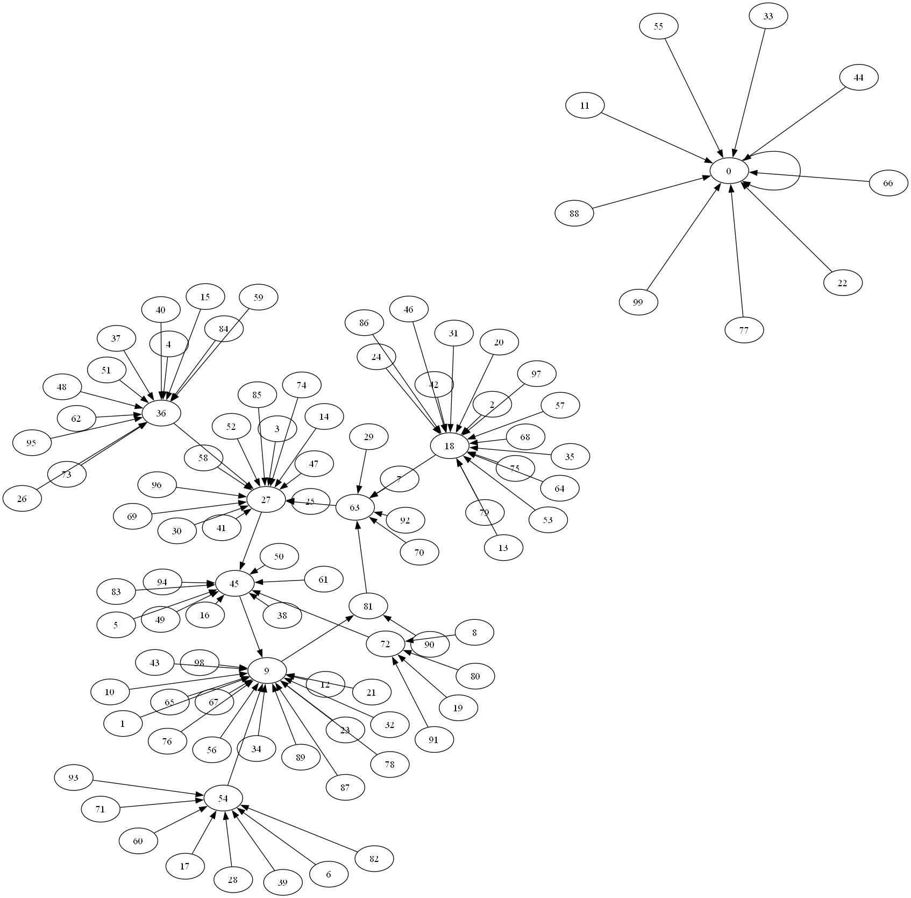

# Kaprekar's Numbers Graphing

This project is a small digraph I wanted to view with regards to
[Kaprekar's Constant](https://en.wikipedia.org/wiki/6174), which is the
number 6174. Basically, I wanted to create some analyses on the number (and
other similar numbers) in a visual context.

## Digraphs

The following are a series of digraphs I generated to visualize the
relationships between the numbers. I've also appended the runtimes to
demonstrate how much more computational work is applied on higher numbers.

| Digits | Graph                                    | Notes                                                                                                                                                                                                                                                                                        | Time to complete (s) |
| ------ | ---------------------------------------- | -------------------------------------------------------------------------------------------------------------------------------------------------------------------------------------------------------------------------------------------------------------------------------------------- | -------------------- |
| 2      |  | The simplest case demonstrates two properties of Kaprekar's Routine - The routine ends in some constant value, and duplicate values (repdigits) terminate in 0. For `k=2`, there is no Kaprekar's Constant; Instead, the patterns always end in a cycle of `9 -> 81 -> 63 -> 27 -> 45 -> 9`. | 0.59 s               |
| 3      |  | The 3-digit case is a lot more interesting. It's harder to see here, but Kaprekar's Constant for 3 digits is 495.                                                                                                                                                                            | 2.20 s               |

I've left out the 4 digit case as it is simply too big.

# License TL;DR

This project is distributed under the MIT license. This is a paraphrasing of a
[short summary](https://tldrlegal.com/license/mit-license).

This license is a short, permissive software license. Basically, you can do
whatever you want with this software, as long as you include the original
copyright and license notice in any copy of this software/source.

## What you CAN do:

-   You may commercially use this project in any way, and profit off it or the
    code included in any way;
-   You may modify or make changes to this project in any way;
-   You may distribute this project, the compiled code, or its source in any
    way;
-   You may incorporate this work into something that has a more restrictive
    license in any way;
-   And you may use the work for private use.

## What you CANNOT do:

-   You may not hold me (the author) liable for anything that happens to this
    code as well as anything that this code accomplishes. The work is provided
    as-is.

## What you MUST do:

-   You must include the copyright notice in all copies or substantial uses of
    the work;
-   You must include the license notice in all copies or substantial uses of the
    work.

If you're feeling generous, give credit to me somewhere in your projects.
